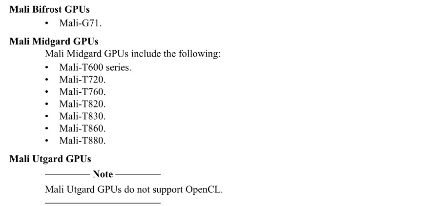

# Ch01 Introduction

## About Arm® Mali™ GPUs

Arm®生产Mali™GPU系列。Midgard是Mali GPU架构之一。

Mali GPU并行运行包含**较少控制代码的数据处理任务**。Mali GPU通常包含比应用程序处理器更多的处理单元。这使Mali GPU能够以比应用处理器更高的速率进行计算，而无需使用更多功率。

Mali GPU可以具有一个或多个Shader Cores。每个Shader Core包含一个或多个算术pipes。

Mali Midgard GPU中的算术pipes**基于单指令多数据（SIMD）样式的向量化**，因此指令可同时对多个数据元素进行操作。 您**必须显式向量化shader代码**，此功能才能起作用。

该链接显示了支持OpenCL的GPU列表 https://en.wikipedia.org/wiki/Mali_(GPU) 。很可惜Xilinx ZynqMP的GPU(Mali-400MP2)不在支持范围内。

Mali-400MP2：https://community.arm.com/developer/tools-software/graphics/f/discussions/9464/mali-400-mp2-opencl

## About OpenCL

开放式计算语言（OpenCL）是一种开放标准，使您能够**使用多种类型的处理器的并行处理功能**，包括应用程序处理器，图形处理单元（GPU）和其他计算设备。

OpenCL使并行应用程序更易于编写，因为它**使您可以在多个应用程序处理器和GPU之间执行应用程序**。

OpenCL是Khronos集团开发的开放标准。

## About the Mali GPU OpenCL driver and support

Mali™GPU OpenCL驱动程序是针对Mali GPU的OpenCL的实现。Mali GPU OpenCL驱动程序支持不同版本的OpenCL。

Mali Midgard驱动程序支持OpenCL 1.2版完整配置文件。

该驱动程序与OpenCL 1.0，OpenCL 1.1和OpenCL 1.2应用程序二进制兼容。该驱动程序还与OpenCL 1.2中不推荐使用的API兼容。

