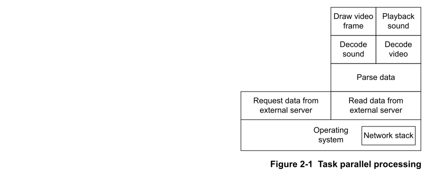
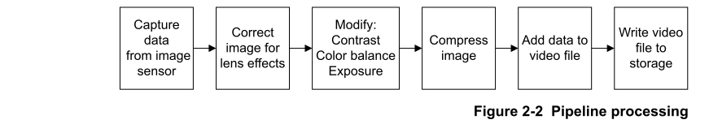
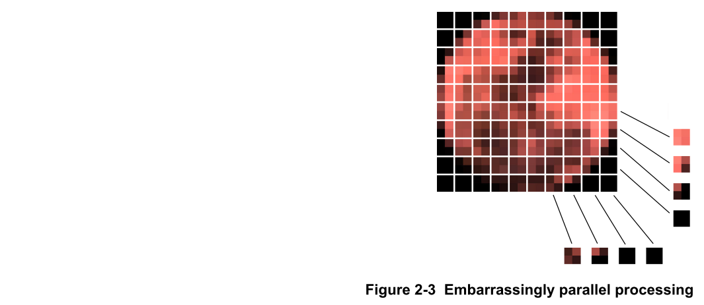
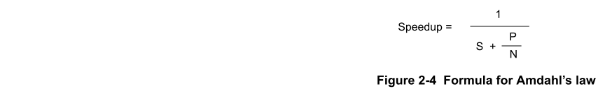

# Ch02 Parallel processing concepts

## About parallel processing

并行处理是多个计算的同时处理。

应用处理器通常被设计为尽快执行单个线程。 这种类型的处理通常包括标量运算和控制代码。

GPU旨在同时执行大量线程。图形应用程序通常需要许多可以在许多处理器上并行计算的操作。

OpenCL使您可以使用GPU或多核应用处理器的并行处理功能。

OpenCL是一种开放标准语言，使开发人员能够在GPU，应用处理器和其他类型的处理器上运行通用计算任务。

## Types of parallelism

数据并行性，任务并行性和流水线是并行性的主要类型。

本节包含以下小节：

### Data parallelism

在数据并行性中，数据分为处理器可以并行处理的数据元素。几个**不同的处理器** **同时**读取和处理**不同的数据元素**。

数据必须采用处理器可以并行读写的**数据结构**。

数据并行应用程序的一个示例是呈现三维图形。生成的像素是独立的，因此生成它们所需的计算可以并行执行。这种并行性的粒度非常细，可以同时涉及成千上万个活动线程。

**OpenCL主要用于数据并行处理**。

### Task parallelism

在任务并行性中，应用程序分为并行执行的较小任务。**任务并行性也称为功能并行性**。

可以使用任务并行性的应用程序示例是在网页中播放视频。要在网页中显示视频，您的设备必须执行以下任务：

- Run a network stack that performs communication.
- Request data from an external server.
- Read data from an external server.
- Parse data.
- Decode video data.
- Decode audio data.
- Draw video frames.
- Play audio data.

下图显示了在播放在线视频时同时运行的应用程序和操作系统的各个部分。

### Pipelines

流水线在一系列阶段中处理数据。在流水线中，这**些阶段可以同时运行**，但是它们**不会处理相同的数据**。流水线通常具有相对较少的阶段数。

流水线的一个示例是必须执行以下步骤的录像机应用程序：

1. Capture image data from an image sensor and measure light levels.
2. Modify the image data to correct for lens effects.
3. Modify the contrast, color balance, and exposure of the image data.
4. Compress the image.
5. Add the data to the video file.
6. Write the video file to storage.

这些阶段**必须按顺序执行**，但是它们都可以**同时对来自不同视频帧的数据执行**。
   
该图显示了可以同时作为流水线运行的视频捕获应用程序的各个部分。

## Mixing different types of parallelism

您可以在应用程序中混合使用不同类型的并行性。

例如，音频合成器可能会通过以下三种方式结合使用所有三种并行性：
- **任务并行**性用于独立计算音符。
- 音频生成和处理模块的**流水线**创建单个音符的声音。
- 在流水线中，某些阶段可以使用**数据并行**性来加速处理的计算。

## Embarrassingly parallel applications (高度并行应用)

如果一个应用程序可以很容易地在大量处理器之间并行化，那么它就是高度并行。

OpenCL非常适合开发和执行高度并行应用程序。

下图显示了一个分为许多小部分的图像。例如，如果您想增亮图像，则可以同时处理所有这些部分。

高度并行应用的另一个示例是渲染三维图形。例如，像素是独立的，因此可以并行计算和绘制像素。

## Limitations of parallel processing and Amdahl's law

开发并行应用程序时必须考虑并行处理的局限性。
 
例如，如果您的应用程序完全并行，则在十个处理器上执行该应用程序将使其运行速度提高十倍。但是，由于部分应用程序是串行的，因此应用程序很少能完全并行。该**串行组件对应用程序可以使用的并行化数量施加了限制**。

阿姆达尔定律描述了并行处理可以实现的最大加速。

下图显示了阿姆达尔定律的公式，其中公式中的术语为：
- S: 串行应用程序的部分。
- P: 可并行化的应用程序的部分。
- N: 处理器数量。

下图显示了不同数量的处理器为具有不同串行组件的应用程序提供的加速。

相对较少的处理器可以实现最大的加速。但是，随着处理器数量的增加，每个处理器的增益会降低。

您无法在应用中回避阿姆达尔法则，但可以减少影响。

对于具有大量处理器的高性能计算，应用程序必须具有非常小的串行组件。这类应用程序称为高度并行程序。

## Concurrency

并发应用程序同时进行多个操作。通过**使用分时系统，它们可以并行或串行运行**。

在并发应用程序中，多个任务尝试共享同一数据。 必须管理对这些数据的访问，以防止出现复杂的问题，例如**竞争状况，死锁和活锁**。

- 竞争条件(Race conditions): 当两个或多个线程试图同时修改一个变量的值时，就会发生竞争条件。通常，计算的最终值将始终产生相同的值，但是当出现竞争条件时，变量可以获取不同的值，具体取决于写入的顺序。
- 死锁(Deadlocks): 当两个线程彼此阻塞并且两个线程都无法进行时，就会发生死锁。当每个线程获得另一个线程需要的锁时，可能会发生这种情况。
- 活锁(Livelocks): 活锁类似于死锁，但是线程继续运行。由于存在锁定，**线程永远无法完成其任务**。

**并发应用程序需要并发数据结构**。并发数据结构是一种数据结构，它使多个任务能够访问数据而没有并发问题。

数据并行应用程序使用并发数据结构。 这些是您通常在OpenCL中使用的数据结构。

OpenCL包括原子操作，以帮助管理线程之间的交互。原子操作提供了一个线程在修改数据项时对其的独占访问。原子操作使一个线程可以读取，修改和写入数据项，并确保没有其他线程可以同时修改数据项。

:star: 注意：OpenCL不保证线程的操作顺序。**线程可以以任何顺序开始和结束**。