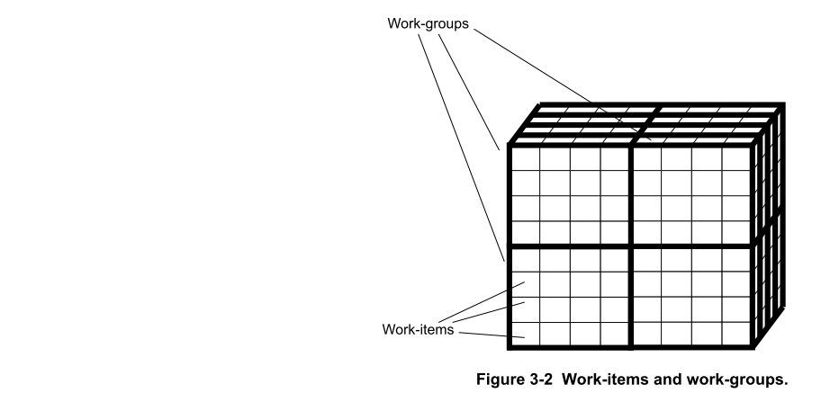

# Ch03 OpenCL Concepts

## 3.1 Using OpenCL

开放式计算语言（OpenCL）是一种开放标准，使您能够使用多种类型的处理器的并行处理功能，包括应用程序处理器，图形处理单元（GPU）和其他计算设备。

OpenCL为并行编程指定了一个旨在实现可移植性的API：
- 它使用抽象的内存和执行模型。
- 不需要知道应用处理器指令集。

在OpenCL设备上执行的函数称为内核。这些都是使用基于C99的称为OpenCL C的语言编写的。

OpenCL语言包括向量类型和内置函数，使您可以使用加速器的功能。还可以通过优化来定位特定的体系结构。

Midgard OpenCL驱动程序支持**OpenCL 1.2**（完整配置文件）。

## 3.2 OpenCL applications

OpenCL应用程序由**两部分**组成：应用程序或主机端代码以及OpenCL内核。

应用程序或主机端代码：
- 调用OpenCL API。
- 编译OpenCL内核。
- 分配内存缓冲区以将数据传入和传出OpenCL内核。
- 设置命令队列。
- 设置任务之间的依赖关系。
- 设置内核执行的N维范围（NDRanges）。

OpenCL内核
- 用OpenCL C语言编写。
- 执行并行处理。
- 在计算设备（例如应用程序处理器或GPU Shader核心）上运行。

您必须正确编写这两个部分才能获得最佳性能。

## 3.3 OpenCL execution model

OpenCL执行模型包括**主机应用程序，上下文和OpenCL内核的操作**。

**主机应用程序**

主机应用程序在**应用程序处理器上**运行。 主机应用程序通过为以下各项设置命令队列来管理内核的执行：
- 内存命令。
- 内核执行命令。
- 同步。

**上下文**

主机应用程序定义了内核的上下文。 上下文包括：
- 内核(The kernels)。
- 计算设备(Compute devices)。
- 程序对象(Program objects)。
- 内存对象(Memory objects)。

**OpenCL内核的操作**

内核在计算设备上运行。内核是在计算设备上**与其他内核并行执行的代码块**。内核按以下顺序操作：
1. 内核在主机应用程序中**定义**。
2. 主机应用程序**提交**内核以在计算设备上执行。计算设备可以是应用处理器，GPU或其他类型的处理器。
3. 当应用程序**发出**提交内核的命令时，OpenCL将创建**工作项**的NDRange。
4. 为NDRange中的**每个元素**创建一个内核实例。 这使得每个元素都可以**并行独立地进行处理**。

## 3.4 OpenCL data processing

OpenCL处理的数据位于**工作项的索引空间**中。

工作项以NRange的形式组织，其中：
- N是维数减去一。
- N可以为0，1或2。

索引空间中的每个工作项都执行一个内核实例。

下图显示了具有一维，二维和三维尺寸的NDRanges。


您可以将工作项目分组到工作组中进行处理。下图显示了一个三维NDRange，它分为16个工作组，每个工作组有16个工作项。



## 3.5 OpenCL work-groups

工作组具有多个**属性，限制和工作项**：

- **工作组的属性**
  - 工作组**彼此独立**。
  - OpenCL驱动程序可以**发出**多个工作组以并行执行。
  - 工作组中的工作项可以使用**共享数据缓冲区相互通信**。您必须同步对这些缓冲区的访问。

- **工作组之间的限制**

  工作组通常**不直接共享数据**。 他们可以**使用全局内存共享数据**。

  不同的工作组不支持以下内容：
  - Barriers.
  - Dependencies.
  - Ordering.
  - Coherency.

  Global atomics是可用的，但它们可能比local atomics慢。

- **工作组中的工作项**

  工作组中的工作项可以：
  - 访问共享内存。
  - 使用本地原子操作。
  - 执行屏障操作以**同步**执行点。

    例如：
    ```c
    barrier（CLK_LOCAL_MEM_FENCE）;  //等待该工作组中的所有工作项都赶上来。
    ```

    同步完成后，可以保证对共享缓冲区的所有写操作都已完成。 这样，工作项就可以安全地读取同一工作组中不同工作项写入的数据。

## 3.6 OpenCL identifiersz

OpenCL中有几个标识符。 这些标识符是全局ID，本地ID和工作组ID。
- 全局ID：每个**工作项**都有一个唯一的全局ID，可以在索引空间中对其进行标识。
- 工作组ID：每个**工作组**都有一个唯一的工作组ID。
- 本地ID：在每个工作组中，每个**工作项**都有一个唯一的本地ID。

## 3.7 The OpenCL memory model

OpenCL内存模型包含多个组件，并支持多种内存类型。

### 3.7.1 OpenCL memory model overview

下图显示了OpenCL内存模型。


### 3.7.2 Memory types in OpenCL

OpenCL支持以下内存类型：私有内存，本地内存，常量内存和全局内存。

私有内存
- 私有内存特定于工作项。
- 对其他工作项不可见。
   
本地内存
- 本地内存在工作组本地。
- 可被工作组中的工作项访问。
- 通过`__local`关键字进行访问。
- 对工作组中的所有工作项一致。

:star: 注意：工作项以未定义的顺序执行。这意味着您不能保证工作项写入数据的顺序。如果您希望工作项读取由另一个工作项写入的数据，则必须使用屏障来确保它们以正确的顺序执行。

常量内存
- 常量内存是用于主机分配和初始化的对象的内存区域。
- 所有工作项都可以**只读方式**访问它。

全局内存
- 在上下文中执行的所有工作项都可以访问全局内存。
- 主机可以使用read，write和map命令进行访问。
- 在单个工作组中的各个工作项目之间保持一致。
  
  :star: 注：工作项以未定义的顺序执行。 这意味着您不能保证工作项写入数据的顺序。如果要一个工作项读取另一个工作项写入的数据，则必须使用障碍以确保它们以正确的顺序执行。

- 它实现了宽松的一致性，共享内存模型。
- 使用`__global`关键字进行访问。
- 不保证不同工作组之间的内存一致性。

## 3.8 The Mali™  GPU OpenCL memory model

与台式机工作站GPU相比，Mali GPU使用不同的内存模型。台式机工作站GPU和Mali GPU之间的主要区别是：

**台式工作站GPU**
- 传统的台式工作站处理器具有自己的专用内存。
- 台式工作站GPU具有物理上独立的全局，本地和私有内存。
- 通常，图形卡具有自己的内存。
- 数据必须从应用处理器内存复制到GPU内存，然后再复制回来。

**Mali GPU** 
- Mali GPU具有与应用程序处理器**统一的内存系统**。
- Mali GPU使用**带有缓存支持的全局内存来代替本地或私有内存**。
- 如果分配本地或专用内存，则会在全局内存中分配它。将数据从全局内存移动到本地或私有内存通常**不会提高性能**。
- 只要OpenCL以正确的方式分配数据，就不需要复制数据。
- 每个计算设备（即shader核心）都有自己的数据缓存。

## 3.9 OpenCL concepts summary

OpenCL中使用的概念摘要。
- OpenCL主要使用**数据并行**处理。
- OpenCL中的**计算**由在计算设备上执行的称为**内核的代码段执行**。计算设备可以是应用处理器或GPU。
- OpenCL处理的**数据**在工作项的索引空间中。工作项目在NDRange中组织。
- 为索引空间中的每个**工作项**执行一个**内核实例**。
- 内核实例可以**并行**执行。
- 您将工作项目分组在一起以形成工作组。**工作组**中的工作项可以使用共享数据缓冲区相互通信，但是对缓冲区的访问必须与屏障操作同步。
- 工作组通常**不会彼此**直接共享数据。他们可以使用全局内存和原子操作共享数据。
- 您可以发布**多个工作组以并行执行**。


