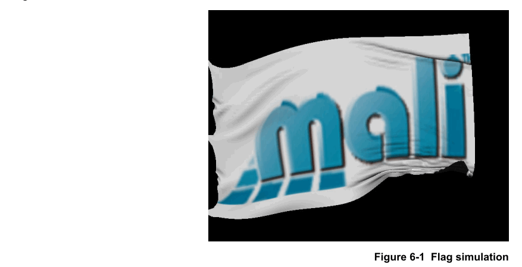
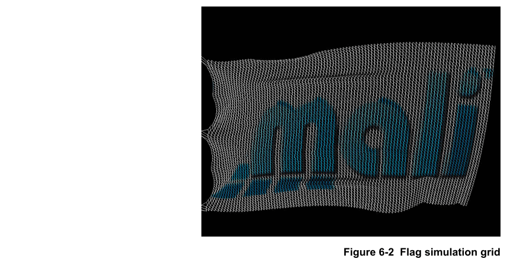

# Ch06 Converting Existing Code to OpenCL

本章介绍将现有代码转换为OpenCL。

## 6.1 Profiling your application

分析您的应用程序以查找最需要计算的部分。这些是可能值得移植到OpenCL的部分。

需要高性能的应用程序比例通常只是代码的一小部分。 这是可以充分利用OpenCL的代码部分。将更多应用程序移植到OpenCL不太可能带来好处。

您可以使用DS-5之类的分析器来分析您的应用程序。

## 6.2 Analyzing code for parallelization

通过检查并行操作，具有较少依赖性的操作以及分析不同类型的循环，分析计算密集型代码并确定并行化的难度。这些因素影响并行化的难度。

### 6.2.1 About analyzing code for parallelization

确定了应用程序中计算最密集的部分后，请分析代码以查看是否可以并行运行它。

并行化代码可能会出现以下困难程度：
- Straightforward: 并行化代码需要进行一些改动。
- Difficult: 并行化代码需要复杂的修改。如果您使用工作项代替循环迭代，请根据全局ID的值而不是循环计数器来计算变量。
- Difficult and includes dependencies：并行化代码需要复杂的修改，并使用各种技术来避免依赖项。您可以按帧计算值，可以分多个阶段执行计算，也可以预先计算值以消除依赖性。
- Appears to be impossible: 如果并行化代码似乎是不可能的，这仅意味着特定的代码实现不能并行化。

  代码的目的是执行功能。可能会有不同的算法执行相同的功能，但工作方式不同。其中一些可能是可并行化的。

  研究代码使用的算法和数据结构的不同替代方案。 这些可能使并行化成为可能。

### 6.2.2 Finding data parallel operations

尝试查找执行大量操作而不共享数据或不依赖彼此结果的任务。这些类型的操作是数据并行的，因此非常适合OpenCL。

### 6.2.3 Finding operations with few dependencies

如果任务几乎没有依赖关系，则可以并行运行它们。任务之间的依赖关系阻止并行化，因为它们迫使任务按顺序执行。

如果代码具有依赖关系，请考虑：
- 是否有消除依赖关系的方法。
- 如果可以延迟依赖关系，以使其在以后的执行中出现。

### 6.2.4 Analyze loops

循环是并行化的良好目标，因为循环多次（通常独立地）重复计算。
 
考虑以下类型的循环：
- Loops that process few elements: 如果循环仅处理**相对少量的元素**，则可能**不适用**于数据并行处理。在一个或多个应用程序处理器上将此类循环**任务并行**可能更好。
- Nested loops: 如果该循环是一系列嵌套循环的一部分，并且迭代的总数很大，则该循环可能适用于并行处理。
- Perfect loops: 
  
  寻找循环：
  - 处理数千个项目。
  - 不依赖于先前的迭代。
  - 在每次迭代中独立访问数据。

    这些类型的循环是数据并行的，因此**非常适合OpenCL**。

- Simple loop parallelization: 如果循环包含一个变量，该变量**基于前一次迭代的值递增**，则这是迭代之间的**相关性**，从而阻止了并行化。
  
  看看是否可以计算出一个**公式**，使您能够基于主循环计数器来计算变量的值。
  
  在OpenCL中，工作项是并行处理的，而不是顺序循环的。但是，工作项处理的作用类似于循环。
  
  每个工作项都有一个唯一的**全局ID**来标识它，您可以使用此值代替循环计数器。
  
  工作项中也可能有循环，但这些循环与其他工作项无关

- Loops that require data from previous iterations：如果您的循环涉及基于先前迭代处理的数据的依赖关系，则这是一个更复杂的问题。
  
  可以重新构造循环以消除依赖关系吗？ 如果没有，则可能无法并行化循环。
  
  有几种技术可以帮助您处理依赖关系。 看看是否可以使用这些技术来并行化循环。
- Non-parallelizable loops：如果循环包含无法删除的依赖项，请研究执行计算的替代方法。 这些可能是可并行的。

## 6.3 Parallel processing techniques in OpenCL

您可以在OpenCL中使用不同的**并行处理技术**。这些技术包括，例如，计算值的不同方式，消除依赖关系，软件流水线和任务并行性。

### 6.3.1 Use the global ID instead of the loop counter

在OpenCL中，您使用内核执行等效的循环迭代。这意味着在计算中**没有要使用的循环计数器**。工作项的**全局ID提供了等效的循环计数器**。使用全局ID执行基于循环计数器的任何计算。

:star: 注意：您**可以在OpenCL内核中包含循环**，但是循环只能遍历该工作项的数据，而不能遍历整个NDRange。

简化的循环示例此示例显示了一个用C语言编写的简单循环，该循环将循环计数器的值分配给每个数组元素。
  
- C语言中的循环示例：

  以下循环用数字填充数组。

  ```c
  void SetElements(void)
  {
      int loop_count;
      int my_array[4096];
      for (loop_count = 0; loop_count < 4096; loop_count++)
      {
          my_array[loop_count] = loop_count;
      }
      printf("Final count %d\n", loop_count);
  }
  ```
该循环是可并行的，因为循环元素都是独立的。OpenCL内核中没有主循环计数器`loop_count`，因此将其替换为全局ID。
- OpenCL内核中的等效代码：

  ```c
  __kernel void example(__global int * restrict my_array)
  {
      int id;
      id = get_global_id(0);
      my_array[id] = id;
  }
  ```
### 6.3.2 Compute values in a loop with a formula instead of using counters

如果您使用工作项代替循环迭代，请根据全局ID的值而不是循环计数器来计算变量。工作项的全局ID提供了等效的循环计数器。

### 6.3.3 Compute values per frame

如果您的应用程序**需要连续更新数据元素**并且它们之间**存在依赖**关系，请尝试将计算分解为离散的单位，并对显示的每个图像帧执行一次迭代。

例如，下图显示了应用程序，它运行Flag的连续物理模拟。



该Flag由连接到相邻节点的节点网格组成。 这些节点如下图所示。



仿真以一系列迭代的方式运行。 在一次迭代中，所有节点都将更新，并且图像将重新绘制。

每次迭代执行以下操作：
1. 从缓冲区A读取节点值。
2. 物理模拟计算节点之间的力。
3. 更新节点上的位置和力并将其存储在缓冲区B中。
4. 绘制Flag图像。
5. 切换缓冲区A和缓冲区B。

在这种情况下，将计算拆分为迭代也会拆分依赖项。一帧所需的数据在前一帧中计算。

某些类型的仿真需要相对较小的运动进行多次迭代。如果是这种情况，请尝试在绘制帧之前计算多次迭代。

### 6.3.4 Perform computations with dependencies in multiple-passes

如果您的应用程序需要**连续更新数据元素**并且它们之间**存在依赖**关系，请尝试将计算**分解为离散的单元**，然后**分多个阶段执行计算**。

该技术扩展了通过进一步拆分计算来计算每帧值的技术。

将数据元素分为奇数和偶数字段。 这样可以划分依赖性，从而可以分阶段执行整个计算。处理在计算奇数然后是偶数字段之间交替进行。

例如，该技术可用于神经网络仿真。

各个神经元排列在三维网格中。 计算神经元的状态涉及读取周围神经元的输入。这意味着每个神经元都依赖于周围神经元的状态。

为了执行仿真，将三维网格划分为多个层并按以下方式执行：
1. 读取偶数节点值。
2. 计算奇数层并存储结果。
3. 读取奇数节点值。
4. 计算偶数层并存储结果。

### 6.3.5 Pre-compute values to remove dependencies

如果计算的一部分是串行的，请查看**是否可以将其删除并单独执行**。

例如，音频合成技术频率调制（FM）通过读取称为载波的音频波形来工作。 读取波形的速率取决于另一个称为调制器的波形。

在一种算法中，指针读取载波值以生成输出波形。指针的位置是通过获取前一个值并将其移动一个由调制器波形的值确定的量来计算的。

指针的位置与先前的值有关，并且该值与之前的值有关。 这一系列的依赖关系使得算法很难或不可能并行化。

另一种方法是考虑指针以固定的速度移动通过载波波形，而调制器则在增加或减少偏移量。 这可以并行计算，但是偏移量是不正确的，因为它们没有考虑对先前偏移量的依赖性。

正确偏移的计算是一个串行过程。 **如果您预先计算这些值，则剩余的计算可以并行化**。 并行组件从生成的偏移表中读取并使用它从载波波形中读取正确的值。

此示例存在潜在的问题。每当调制波形发生变化时，都必须重新计算偏移表。这是阿姆达尔定律的一个例子。 可能的并行计算量受串行计算速度的限制。

### 6.3.6 Use software pipelining

软件流水线是一种并行处理技术，通过**将计算分为一系列连续的阶段**，可以同时处理多个数据元素。

流水线在硬件和软件中都很常见。例如，应用处理器和GPU使用硬件流水线。图形标准OpenGL ES基于虚拟流水线。

在流水线中，一个完整的过程分为几个阶段。在一个阶段中处理数据元素，然后将结果传递到下一个阶段。

由于**流水线的顺序性质**，特定数据元素一次仅使用一个阶段。这意味着其他阶段可以处理其他数据元素。

您可以在应用程序中使用软件流水线来处理不同的数据元素。

例如，游戏需要进行许多不同的操作。游戏可能使用与此类似的流水线：
1. 从玩家读取输入。
2. 游戏逻辑计算游戏进度。
3. 根据游戏逻辑的结果移动场景对象。
4. 物理引擎计算场景中所有对象的位置。
5. 游戏使用OpenGL ES在屏幕上绘制对象。

### 6.3.7 Use task parallelism

任务或功能并行性涉及按功能将应用程序划分为不同的任务。

例如，在线游戏可以利用任务并行性。要运行在线游戏，您的设备执行多项功能：
- 与外部服务器通信。
- 读取播放器输入。
- 更新游戏状态。
- 产生声音效果。
- 播放音乐。
- 更新显示。

这些任务**需要同步**，但是在很大程度上是独立的操作。这意味着您可以在单独的处理器上并行执行任务。

任务并行性的另一个示例是数字电视（DTV）。电视可能随时执行以下几种操作：
- 下载程序。
- 录制节目。
- 更新节目指南。
- 显示选项。
- 从媒体存储设备读取数据。
- 播放程序。
- 解码视频流。
- 播放音频。
- 将图像缩放到正确的尺寸。

## 6.4 Using parallel processing with non-parallelizable code 

如果您无法并行化代码，则**仍然可以使用并行处理**。代码无法并行化的事实仅意味着特定的实现无法并行化。这**并不意味着不能并行解决问题**。

大多数代码被编写为在顺序运行的应用程序处理器上运行。该代码使用串行算法和非并行数据结构。并行处理这种代码可能很困难或不可能。

研究以下方法：

- 使用数据结构和算法的并行版本：
  - 许多常见的数据结构和使用它们的算法都是非并行的。这样可阻止您并行化代码。
  - 许多通用数据结构和算法都有并行版本。您也许可以使用这些代码代替原始代码来并行化代码。
- 以不同的方式解决问题：
  - 分析代码解决了什么问题。
  - 查看问题并研究解决问题的替代方法。可能存在使用可并行化的算法和数据结构的替代解决方案。
  - 为此，请考虑代码和数据结构的目的。
  - 通常，代码的目的是处理或转换数据。 它需要一定的输入并产生一定的输出。
  - 请考虑以下可能性是否成立：
    - 您可以将要处理的数据分为小数据元素。
    - 数据元素可以放入并发数据结构中。
    - 数据元素可以独立处理。
   
      如果这三种可能性都成立，那么您可能可以使用OpenCL解决问题。

## 6.5 Dividing data for OpenCL 

您必须拆分数据并在可能的情况下**使用并发数据结构**以供OpenCL处理。 本节显示一维，二维和三维数据的示例。

### 6.5.1 About dividing data for OpenCL

数据被分割，因此可以与OpenCL并行计算。

数据分为三个层次结构：
- NDRange: NDRange中的元素总数称为全局work size
- 工作组：NDRange分为工作组。
- 工作项：每个工作组均分为多个工作项。

### 6.5.2 Use concurrent data structures

OpenCL执行数百或数千个单独的内核实例，因此**处理和数据结构必须在该程度上可并行化**。这意味着您必须使用允许**同时且独立地读取和写入多个数据元素**的数据结构。这些被称为并发数据结构。

许多常见的数据结构是非并发的。 这使得并行化代码变得困难。 例如，以下数据结构在写入数据时通常是非并发的：
- Linked list.
- Hash table.
- Btree.
- Map.

这并不意味着您不能使用这些数据结构。 例如，这些数据结构都可以并行读取而没有任何问题。
   
工作项也可以写入这些数据结构，但是您必须了解以下限制：
- 工作项可以**访问任何只读数据结构**。
- 如果工作项写入不同的元素，则工作项可以写入任何数据结构
- 如果保证两个工作项都将相同的值写入元素，则工作项可以写入任何数据结构中的相同元素。

或者，工作项可以在任何数据结构中的**同一元素中写入不同的值**，如果在最终输出中无关紧要，则哪个值是正确的。这是因为任何一个值都可能是最后要写入的值。
- 如果工作项可能影响其他元素，则它们不能更改数据结构中的链接。
- 如果多个原子指令不访问同一数据，则工作项可以使用原子指令更改数据结构中的链接。

许多常用数据结构都有并行版本。

### 6.5.3 Data division examples

您可以使用OpenCL处理一维，二维或三维数据。

:star: 注意: 示例将问题映射到维数相同的NDRanges中。OpenCL不需要您执行此操作。例如，您可以将一维问题映射到二维或三维NDRange。

- One-dimensional data

  一维数据的示例是音频。音频表示为一系列样本。 更改音频的音量是一项并行任务，因为每个样本都独立执行该操作。

  在这种情况下，NDRange是音频中样本的总数。 每个工作项可以是一个样本，而工作组则是样本的集合。
   
  音频也可以使用向量进行处理。 如果您的音频样本是16位的，则可以使一个工作项代表8个样本，并使用向量指令一次处理8个样本。

- Two-dimensional data

  图像很适合OpenCL，因为您可以通过将1600x1200像素图像映射到1600x1200的二维NDRange上来处理图像。工作项的总数是像素的总数，也就是192万个。    
  
  NDRange分为工作组，其中每个工作组也是二维数组。工作组的数量必须精确地划分为NDRange。
  
  如果每个工作项处理单个像素，则工作组大小为8x16的大小为128。此工作组大小恰好适合x和y轴上的NDRange。要处理图像，您需要15 000个工作组，每个工作组有128个工作项。
  
  您可以通过在单个向量中处理所有颜色通道来向量化此示例。如果通道是8位值，则可以在单个向量中处理多个像素。如果每个向量处理四个像素，则意味着每个工作项处理四个像素，并且您需要的工作项减少了四倍来处理整个图像。这意味着您的NDRange可以通过1200减少到400，并且只需要3750个工作组即可处理图像。

- Three-dimensional data
  
  您可以使用三维数据来模拟现实世界中材料的行为。例如，您可以通过模拟三维数据集中的应力来为建筑混凝土的行为建模。

  您可以使用产生的数据来确定保持特定荷载所需的结构的尺寸和设计。

  您可以在游戏中使用此技术来建模对象的物理模型。当物体破碎时，物理模拟使破碎过程更加逼真。

