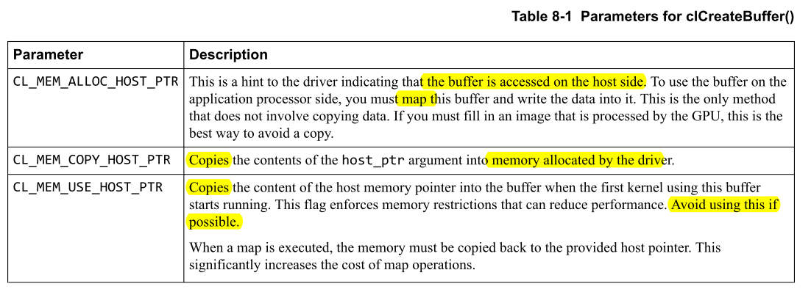
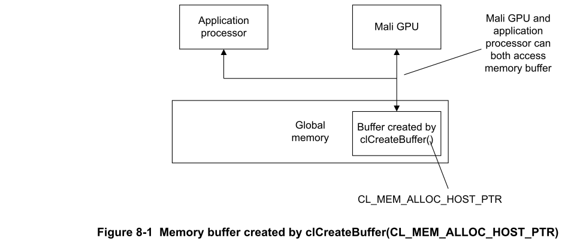
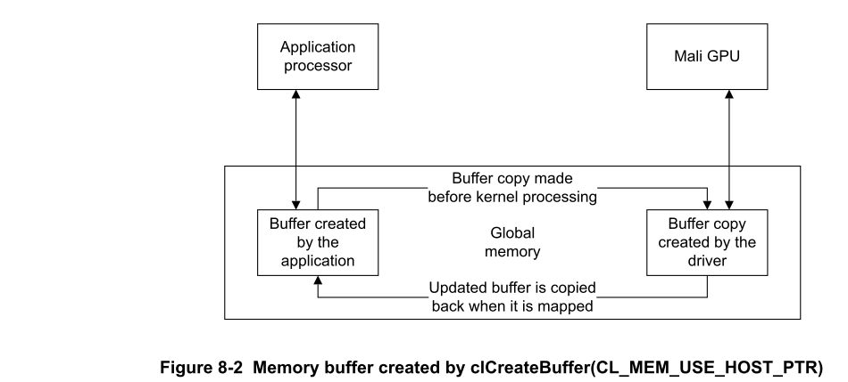
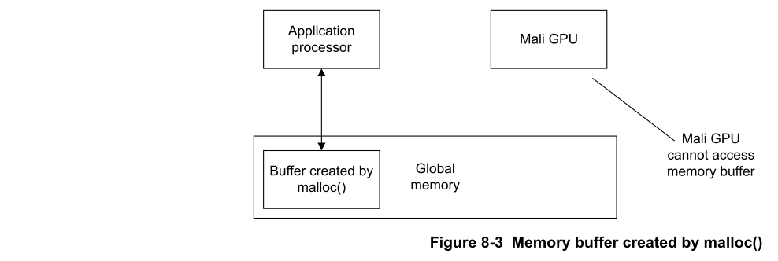

# Ch08 Optimizing OpenCL for Mali GPUs

本章介绍为Mali GPU优化OpenCL应用程序的过程。

## 8.1 The optimization process for OpenCL applications

要优化您的应用程序，您必须首先确定应用程序中计算最密集的部分。在OpenCL应用程序中，这意味着识别花费时间最多的内核。

要确定计算量最大的内核，您必须分别测量每个内核花费的时间： 

- Measure individual kernels

  一次遍历您的内核，然后：
  1. 测量几次运行所花费的时间。
  2. 平均结果。

  :star: 注意：重要的是，您必须测量各个内核的运行时间以获得准确的测量结果。
  
  第一次对内核进行空运行，以确保分配了内存。确保这不在您的计时循环之内。
  
  在某些情况下，某些缓冲区的分配会延迟到第一次使用它们时。这可能会导致第一个内核运行比随后的运行慢。

- Select the kernels that take the most time

  选择运行时间最长的内核并对其进行优化。优化其他任何内核对整体性能几乎没有影响。

- Analyze the kernels

  分析内核，看看它们是否包含计算量大的操作：
  - 测量内核中有多少读写。为了获得高性能，请为每个内存访问执行尽可能多的计算。
  - 对于Mali GPU，可以使用Offline Shader Compiler来检查不同Pipeline之间的平衡。

  :star:注意：使用`-v`的编译器输出不适用于Bifrost GPU。

- Measure individual parts of the kernel

  如果无法通过分析确定内核的计算密集型部分，则可以通过分别测量内核的不同部分来隔离它。
  
  您可以通过删除不同的代码块并每次测量性能差异来做到这一点。
  
  花费时间最多的代码部分是最密集的。考虑如何重写该代码。

## 8.2 Load balancing between control threads and OpenCL threads

如果可以，请**确保控制线程和OpenCL线程并行运行**。

### 8.2.1 Do not use clFinish() for synchronization 

有时，应用程序处理器必须访问OpenCL编写的数据。 此过程必须同步。

您可以使用`clFinish()`执行同步，但是ARM建议您尽可能避免这样做，因为它会序列化执行。调用`clFinish()`会导致延迟，因为控制线程必须等待队列中的所有作业完成执行。控制线程在等待此过程完成时处于空闲状态。

而是尽可能使用`clWaitForEvents()`或回调来确保控制线程和OpenCL可以并行工作。

### 8.2.2 Do not use any of the clEnqueueMap() operations with a blocking call 

使用`clWaitForEvents()`或回调以确保控制线程和OpenCL可以并行工作。

过程
1. 将工作分为多个部分。
2. 对于每个部分： 
   - 在应用程序处理器上为X部分准备工作。
   - 将第X部分OpenCL工作项提交给OpenCL设备。
3. 对于每个部分： 
   - 使用`clWaitForEvents`等待X部分OpenCL工作项在OpenCL设备上完成。
   - 在应用程序处理器上处理来自OpenCL设备的结果。

## 8.3 Memory allocation

您可以使用正确的命令来优化内存分配。

### 8.3.1 About memory allocation

为避免进行复制，请使用OpenCL API分配内存缓冲区，并使用`map()`和`unmap()`操作。这些操作使应用程序处理器和Mali GPU都可以访问数据而没有任何副本。

OpenCL起源于桌面系统，其中应用程序处理器和GPU具有独立的内存。要在这些系统中使用OpenCL，必须分配缓冲区以将数据复制到单独的存储器中或从单独的存储器中复制数据。

具有Mali GPU的系统通常**具有共享内存，因此不需要复制数据**。

但是，OpenCL假定内存是分开的，并且缓冲区分配涉及内存拷贝。这是浪费的，因为copy需要时间并消耗功率。

下表显示了`clCreateBuffer()`中不同的`cl_mem_flags`参数。

ARM®建议以下各项：
- 不要使用私有或本地内存来提高内存读取性能。
- 如果内核受内存带宽限制，请尝试使用简单的**公式来计算变量，而不是从内存中读取**。这样可以节省内存带宽，并且速度可能更快。
- 如果您的内核受计算限制，请尝试**从内存读取而不是计算变量**。这样可以节省计算，并且可能更快。

### 8.3.2 Use CL_MEM_ALLOC_HOST_PTR to avoid copying memory 

Mali GPU可以访问由`clCreateBuffer(CL_MEM_ALLOC_HOST_PTR)`创建的内存缓冲区。这是分配缓冲区的首选方法，因为不需要数据拷贝。

下图显示了这种分配缓冲区的方法。

:star: 注意
- 您必须通过OpenCL API进行初始内存分配。
- 始终使用返回的最新指针。

  如果缓冲区被反复map和unmap，则不能保证该缓冲区map到的地址相同。

### 8.3.3 Do not create buffers with CL_MEM_USE_HOST_PTR if possible 

使用`clCreateBuffer(CL_MEM_USE_HOST_PTR)`创建内存缓冲区时，可能需要驱动程序将数据复制到单独的缓冲区。此拷贝使运行在GPU上的内核可以访问它。如果内核修改了缓冲区，并且应用程序映射了缓冲区以便可以读取，则驱动程序会将更新的数据复制回原始位置。 驱动程序使用应用程序处理器执行这些复制操作，这些操作在计算上很昂贵。

下图显示了这种分配缓冲区的方法。

如果您的应用程序可以使用其他分配类型，则可以避免这些计算量大的复制操作。 例如，`CL_MEM_ALLOC_HOST_PTR`。

### 8.3.4 Do not allocate memory buffers created with malloc() for OpenCL applications

Mali GPU无法访问由`malloc()`创建的内存缓冲区，因为它们没有映射到Mali GPU的地址空间中。

下图显示了不可访问的内存缓冲区。

### 8.3.5 Sharing memory between I/O devices and OpenCL

为了使I/O设备与OpenCL共享内存，必须在OpenCL中使用`CL_MEM_ALLOC_HOST_PTR`分配内存。

您必须使用`CL_MEM_ALLOC_HOST_PTR`在OpenCL中分配内存，因为它可以确保将内存页始终映射到物理内存。

如果在应用程序处理器上分配内存，则操作系统可能不会为页面分配物理内存知道它们首次使用时。 如果I/O设备尝试使用未映射的页面，则会发生错误。

### 8.3.6 Sharing memory in an I/O coherent system

使用I/O一致性分配，在Mali GPU上使用内存对象之前或之后，不需要驱动程序对内存对象执行缓存清理或使操作无效。如果在应用程序处理器和Mali GPU上都使用内存对象，则可以提高性能。

如果您的平台是I/O一致性的，则可以通过将`CL_MEM_ALLOC_HOST_PTR`标志传递给`clCreateBuffer()`或`clCreateImage()`来启用I/O一致性内存分配。
