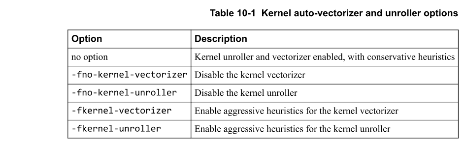
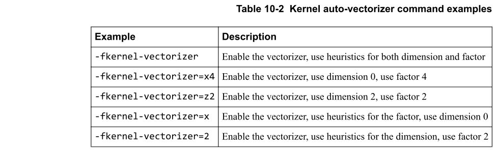
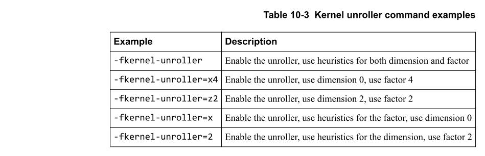

# Ch10 The kernel auto-vectorizer and unroller

本章介绍内核自动向量化器和展开器。

:star: 注意
- 默认情况下，Midgard GPU启用了内核自动向量化器和展开器。
- 此功能不适用于Bifrost GPU。

## 10.1 About the kernel auto-vectorizer and unroller

OpenCL编译器包括一个内核自动向量化器和一个内核展开器：

- 内核自动向量化器获取现有代码并将其转换为向量代码。
- 展开器通过展开内核主体来合并工作项。

如果可能的话，这些操作可以显着提高性能。

有几个选项可以控制自动向量化程序和展开程序。下表显示了基本选项。



:star: 注意
内核自动向量化器执行代码转换。为了使转换成为可能，必须满足几个条件：
- 入队的NDRange必须是向量化因子的倍数。
- 内核中不允许有障碍。
- 内核中不允许使用线程发散代码。
- 入队的NDRange中不允许使用全局偏移。

## 10.2 Kernel auto-vectorizer options 

您可以选择使用维度和因子参数来控制自动向量化器的行为。

### 10.2.1 Kernel auto-vectorizer command and parameters

内核自动向量化器命令的格式为：
```
-fkernel-vectorizer= <dimension><factor>
```
参数为：
- dimension: 选择要向量化的尺寸。
- factor：这是合并以向量化的相邻工作项的数量。该值必须是值2、4、8或16之一。其他值无效。

向量化器通过合并连续的工作项来工作。入队的工作项目数减少了向量化factor。

例如，在一维NDRange中，工作项的本地ID为0、1、2、3、4、5 ...

向量乘以4的factor会将工作项合并为一组4个。 第一个工作项目0、1、2和3，然后工作项目4、5、6和7以四个为一组向上上升，直到NDRange结束。

在二维NDRange中，工作项具有本地ID，例如(0,0)，(0,1)，(0,2)...，(1,0)，(1,1)，  (1,2)...其中(x，y)显示(global_id(0)，global_id(1))。

向量化器可以沿维度0进行向量化并合并工作项(0,0)，(1,0)...

或者，它可以沿维度1向量化并合并工作项(0,0)，(0,1)...

### 10.2.2 Kernel auto-vectorizer command examples

该表显示了自动向量化器命令的示例。



## 10.3 Kernel unroller options

您可以选择使用其他参数来控制内核展开器的行为。

### 10.3.1 Kernel unroller command and parameters

kernel unroller命令的格式为：
```
-fkernel-unroller= <dimension><factor>
```

参数为：
- dimension: 选择展开的维度。
- factor：这是被合并的相邻工作项的数量。

展开的性能提高取决于您的内核和展开因子，因此请尝试查看适合您的内核的性能。通常最好将展开系数保持在8或以下。


### 10.3.2 Kernel unroller command examples

该表显示了内核展开器命令的示例。



## 10.4 The dimension interchange transformation

维度互相转换交换工作组的维度。这种转换可以改善缓存的局部性并提高性能。

维度互换适用于带有以下注释的内核：

- `__attribute__ ((annotate("interchange")))`: 这将维度0和1互换。
- `__attribute__ ((annotate("interchange<dim0><dim1>")))`：这将互换维度dim0和dim1，其中<dim0>和<dim1>可以为0、1或2。

您可以使用以下选项禁用维度互换：`-fno-dim-interchange`，不跟参数。