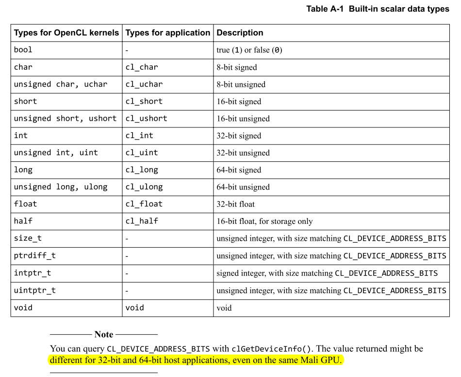
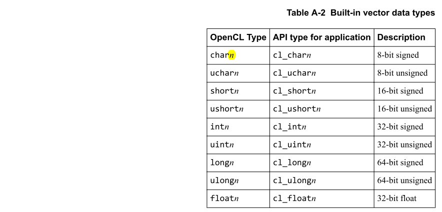
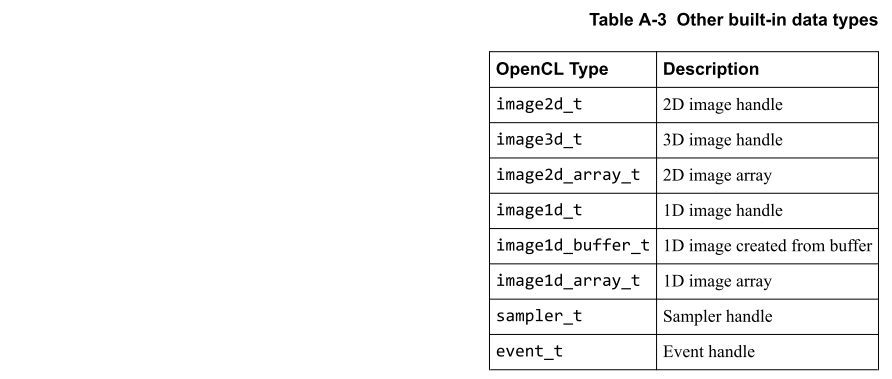
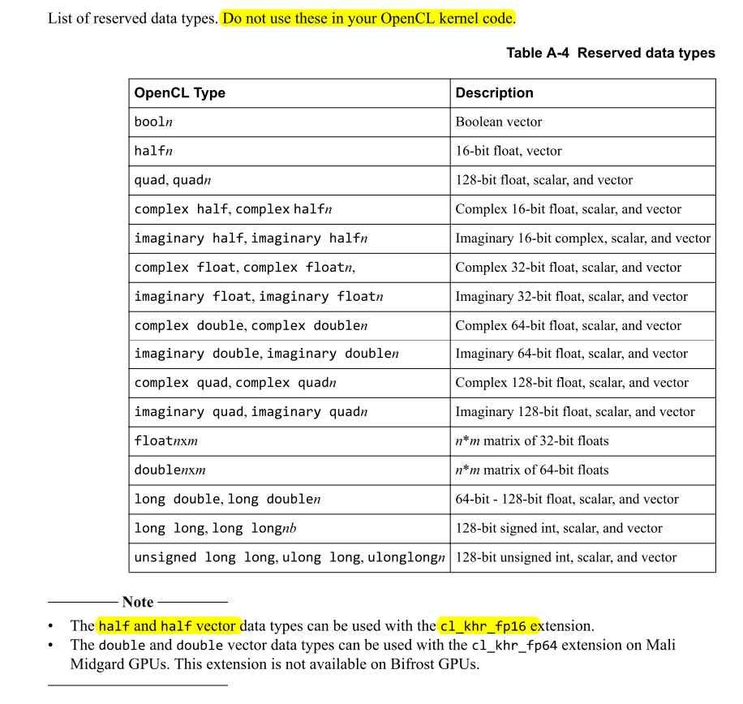

# Appendix A OpenCL Data Types

本附录描述OpenCL数据类型。

## A.1 About OpenCL data types

本附录列出了OpenCL中可用的数据类型。Mali GPU硬件本身支持所有这些类型。

OpenCL C中使用OpenCL类型。API类型与您的应用程序中使用的等效。使用这些来确保使用正确的数据，并在128位或16字节边界上对齐。

128位的向量大小是最佳的。大于128位的向量大小分为128位部分，并分别进行操作。例如，相加两个256位向量的时间是相加两个128位向量的时间的两倍。您可以使用小于128位的向量大小而不会出现问题。

使用大于128位的向量的缺点是它们会增加代码大小。增加的代码大小会**占用更多的指令缓存空间，这会降低性能**。

在Mali GPU上，向量类型之间的转换具有较低的性能成本。例如，将8位值的向量转换为16位值：

```c
ushort8 a;  uchar8 b;
a = convert_ushort8(b);
```
## A.2 OpenCL data type lists

按类型组织的OpenCL数据类型列表。

### A.2.1 Built-in scalar data types

内置标量数据类型列表。



### A.2.2 Built-in vector data types

内置向量数据类型的列表，其中n = 2、3、4、8或16。



### A.2.3 Other built-in data types



### A.2.4 Reserved data types



# Appendix B OpenCL Built-in Functions

本附录列出了OpenCL内置函数。

# Appendix E OpenCL 1.2

本附录描述了OpenCL 1.2中对Mali OpenCL驱动程序的一些重要更改。

## E.1 OpenCL 1.2 compiler options 

OpenCL 1.2添加了用于**离线和在线编译**的选项。

OpenCL 1.2中添加了以下选项：
- Online compilation
  
  在OpenCL 1.2中，可以在Online编译期间编译和链接单独的OpenCL文件。您指定用于编译的所有编译器标志都用于**前端和中级优化**。这些标志在后端编译和链接期间被丢弃。您也可以在**链接阶段指定编译器标志的有限列表**。链接后，**这些标志将转发到编译器后端**。
  
  您可以在编译不同模块的过程中提供不同的标志，因为它们仅影响单独模块的前端和中级转换。在构建过程的后期，共同链接的模块会使用在链接阶段传递给整个链接程序的标志来覆盖这些标志。将使用不同的各种选项分别编译的模块混合在一起是安全的，因为仅将有限的一组链接标志应用于整个程序。
  
  **全套标志只能影响早期的编译步骤**。例如，如果传递了`-cl-opt-disable`，则仅禁用早期的优化阶段。在链接阶段，`-cl-opt-disable`选项将被忽略，后端会优化模块。  `-cl-opt-disable`被忽略，因为它不是允许的链接时选项。

- Offline compilation

  在OpenCL 1.2中，对于Offline编译，命令行上没有单独提供编译和链接步骤。 编译和链接会与您在命令行上指定的源文件一起在一个阶段中进行。
  
  您可以指定几个构建选项以及源文件。 这些标志应用于从前端到后端的所有文件和所有编译阶段，以生成最终的二进制文件。
  
  例如： 
  ```c
  mali_clcc -cl-opt-disable file1.cl file2.cl -o prog.bin
  ```
## E.2 OpenCL 1.2 compiler parameters

OpenCL 1.2添加了许多编译器参数。

OpenCL 1.2包含以下编译器参数：

- -create-library: 编译器将创建一个已编译二进制文件的库。
- -enable-link-options：这使您可以修改使用`-create-library`创建的库的行为。
- -cl-kernel-arg-info：这使编译器可以在程序可执行文件中存储有关内核参数的信息。

## E.3 OpenCL 1.2 functions 

## E.4 Functions deprecated in OpenCL 1.2 

## E.5 OpenCL 1.2 extensions 